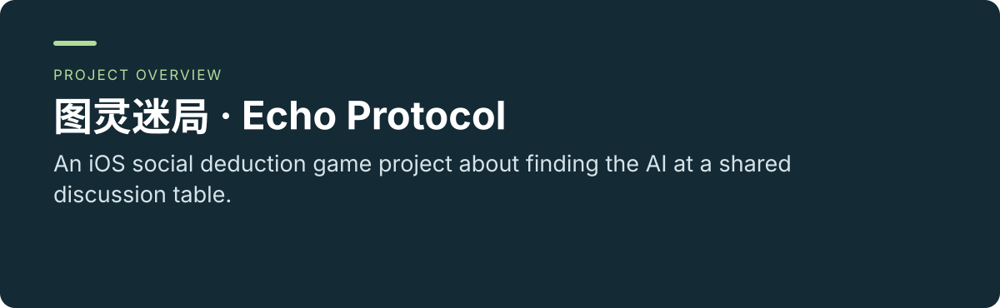
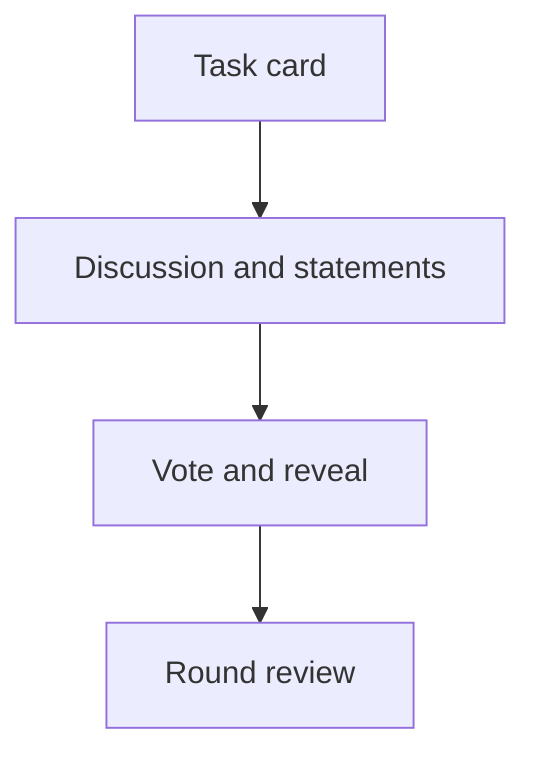

 

# 图灵迷局 · Echo Protocol

**An iOS social deduction game project about finding the AI at a shared discussion table.**

[Project usage and maintenance](../README.md) · [Report an issue](https://github.com/thejaytang/Echo-Protocol/issues)

## 1. What you can do

- Follow a round through discussion, final statements, voting and reveal.
- Inspect a native SwiftUI client and a server-owned game state machine.

## 2. Start here

Use the [project guide](../README.md) for backend commands and Xcode configuration. Echo-Protocol is the repository name; 图灵迷局 is the product name; Mirage remains an internal code name.

## 3. Use cases

These are illustrative scenarios. Only explicitly linked execution artifacts represent checks performed for this update.

| Input or request | Expected result |
|---|---|
| A player conversation | A completed vote, identity reveal and review |
| A developer exploring the game | Client source, game-mode rules and API contracts |

## 4. Requirements and current limits

Development project, not a confirmed App Store release. Full iOS build/archive and real service configuration are separate requirements. The CI run triggered by this update reports a failed game-mode flow assertion (`classicMode.flow` should include “创建房间”); both backend and iOS-structure jobs remain red. See the [check results](https://github.com/thejaytang/Echo-Protocol/actions/runs/35663514847). The preceding commit also had failing CI; this update changes presentation files only. The web prototype is an earlier visual study, not the current native client.

## 5. Documentation and sources

These links identify the implementation, operating instructions or related projects for a closer fit check.

- [Game-mode blueprint](../docs/GAME_MODE_BLUEPRINT.md)
- [API contract](../docs/API_CONTRACT.md)
- [Deployment](../docs/DEPLOYMENT.md)

## 6. License and maintenance

No repository-wide license is declared at the root. This presentation update does not change the terms of code, data or third-party material; confirm permission for the material you want to reuse.

This is the public introduction. Linked project documents remain authoritative for operation, constraints and maintenance. Presentation updated: 2026-09-22.
