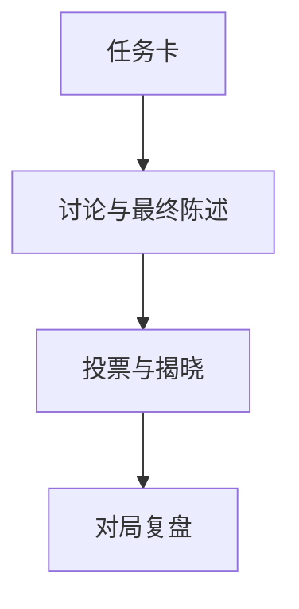

 

# 图灵迷局 · Echo Protocol

**一个围绕圆桌讨论、识别隐藏 AI 展开的 iOS 社交推理游戏项目。**

[项目使用与维护入口](../README.md) · [报告问题](https://github.com/thejaytang/Echo-Protocol/issues)

## 1. 能完成什么

- 经历讨论、最终陈述、投票与揭晓的一局推理。
- 查看原生 SwiftUI 客户端与由服务端管理的游戏状态机。

## 2. 从这里开始

后端运行与 Xcode 配置见[项目指南](../README.md)。Echo-Protocol 是仓库名，图灵迷局是产品名，Mirage 保留为内部代码名称。

## 3. 使用场景

以下为说明性场景；只有明确链接的运行产物才代表本次检查结果。

| 输入或请求 | 预期结果 |
|---|---|
| 玩家讨论 | 投票、身份揭晓与复盘 |
| 研究游戏的开发者 | 客户端源码、玩法规则和 API 契约 |

## 4. 使用条件与当前边界

开发中的项目，不代表已在 App Store 正式发布。完整 iOS 构建归档与真实服务配置需要另外完成。本次更新触发的自动检查发现游戏模式流程断言失败，`classicMode.flow` 未包含测试要求的“创建房间”；backend 和 ios-structure 两项检查未通过，详见[检查记录](https://github.com/thejaytang/Echo-Protocol/actions/runs/35663514847)。前一提交的自动检查也已失败；本轮只改动展示文件。网页原型是早期视觉研究，不是当前原生客户端。

## 5. 资料与来源

下面链接指向实现、操作说明或相关项目，便于进一步判断适用性。

- [玩法蓝图](../docs/GAME_MODE_BLUEPRINT.md)
- [API 契约](../docs/API_CONTRACT.md)
- [部署说明](../docs/DEPLOYMENT.md)

## 6. 许可与维护

仓库尚未在根目录声明统一许可证；本次展示更新没有改变代码、数据或第三方材料的许可。复用前请确认对应材料的授权。

本页为对外介绍。具体操作、约束和维护说明以链接的项目文档为准。展示页更新：2026-09-22。
